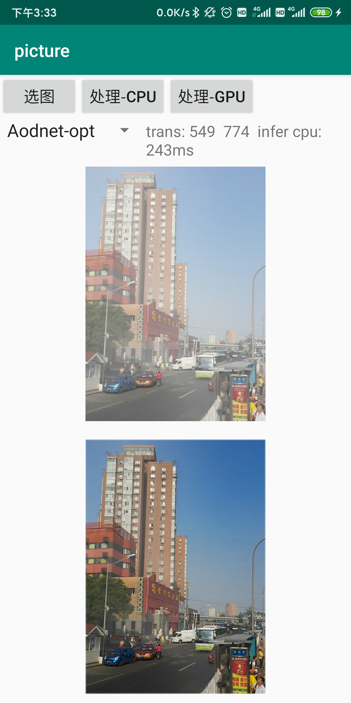
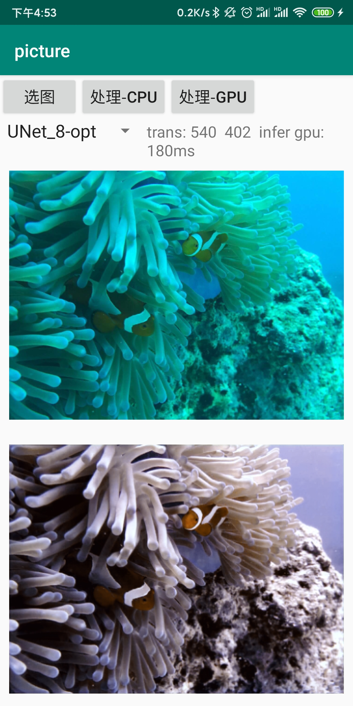

# ncnn-picture-enhancement
A simple demo to run dehaze / underwater model in Android

## Curretly Implemented:
- [AOD-Net](https://github.com/MayankSingal/PyTorch-Image-Dehazing)：dehaze
- [UWGAN](https://github.com/infrontofme/UWGAN_UIE) :underwater enhancement

## Need to do
- git clone
- download ncnn libs for [Android](https://github.com/Tencent/ncnn/releases/tag/20200616)
- put the libs in **src/main/cpp/ncnn-android-vulkan**
- models  are already provided in **assets**

## Results
- AON-Net

- UNet(model is already update, old version is pic/Unet.jpg)

## Time cost
using Xiaomi, 845cpu

|  | cpu(*4)|gpu |
| :-----| :---: | :----: |
| AODNet(800*500) | 200ms |  |
| UNet(400*550) |  | 150ms |

## Reference
- [ncnn](https://github.com/Tencent/ncnn)
- [AOD-Net](https://github.com/MayankSingal/PyTorch-Image-Dehazing)
- [UWGAN](https://github.com/infrontofme/UWGAN_UIE)
